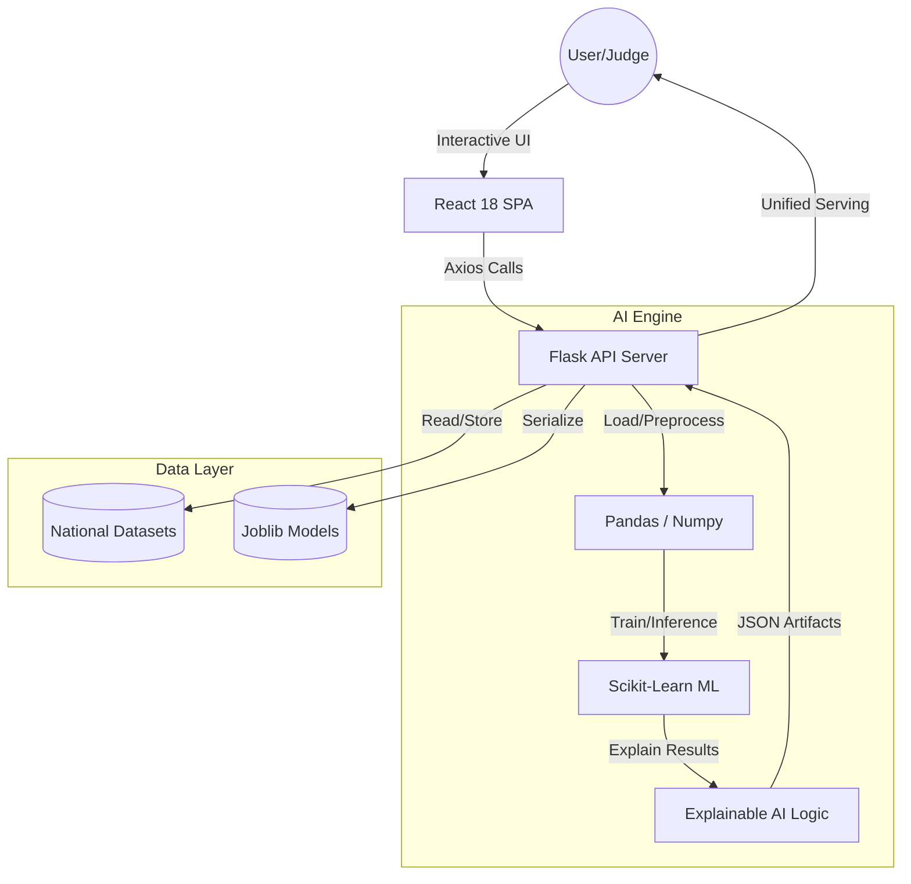

# 🚀 SkillGenome X: National Talent Intelligence System
> **"Turning the invisible workforce into national assets through Explainable AI."**

SkillGenome X is a cutting-edge, AI-powered platform designed to map, analyze, and predict the socio-economic skill landscape. It bridges the gap between raw data and actionable policy, providing a transparent "National Skill Genome" to optimize workforce development and mitigate migration risks.

---

## 🏗️ The Tech Stack
Built for speed, scalability, and impact.

| Layer | Technologies |
| :--- | :--- |
| **Frontend** | React 18, Vite, Tailwind CSS, Framer Motion |
| **Data Viz** | Recharts, React Simple Maps, Lucide Icons |
| **API/Backend** | Python 3.12, Flask, Gunicorn |
| **AI/ML Engine** | Scikit-learn (GradientBoosting, IsolationForest), Pandas, Numpy |
| **Deployment** | Vercel (Frontend), Render / Docker (Backend) |

---

## 🌟 Key Features (The "Wow" Factor)

### 🧠 National AI Engine
- **Real-time Predictions**: Instantly evaluates skill profiles and socio-economic risks.
- **Explainable AI (XAI)**: Don't just get a score—understand *why*. The system breaks down exactly which factors (e.g., internet penetration vs. literacy) drove the prediction.
- **Anomaly Detection**: Uses unsupervised learning to flag unusual data profiles, ensuring high data integrity.

### 🗺️ Regional Intelligence
- **Interactive Heatmaps**: State-level analysis of talent density and innovation intensity.
- **State-Specs Engine**: Deep-dives into individual state ecosystems to provide hyper-local insights.

### 🔮 Policy Simulation ("What-If" Engine)
- **Macro-Impact Simulation**: Adjust levers like "Digital Access" or "Skilling Infrastructure" to see real-time impact on national migration and risk levels.
- **Rule-Based Recommendations**: Automated, AI-driven policy suggestions for specific regional challenges.

### 📊 Live Data Foundation
- **Custom CSV Pipeline**: Upload your own datasets to retrain the model instantly.
- **Model Comparison**: Automatically trains and selects the best-performing model (GradientBoosting vs. Random Forest) based on R² accuracy.

---

## 🛠️ System Architecture

---

## 📈 Impact Summary
SkillGenome X transforms stagnant demographic data into a **living intelligence system**. 
- **For Policy Makers**: A simulation tool to justify infrastructure spending.
- **For Educators**: A roadmap of emerging vs. declining skill trends.
- **For Citizens**: A transparent assessment of their economic potential and risks.

---

> [!TIP]
> **Ready for Pitch**: Use this document to explain the technical robustness and the "Human-in-the-loop" AI approach of SkillGenome X.
